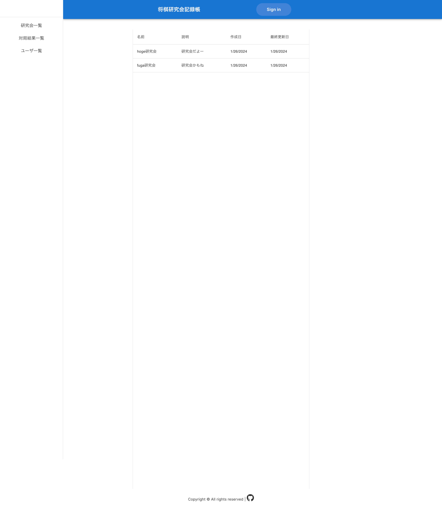

# 将棋研究会記録帳

名前の通り、将棋の研究会の記録をとるためのwebアプリ。
もっとかっこいい名前にしたい。

# デモ



# 使い方

まだ開発中なので開発者向け起動コマンドのみ示す。ホットリロードが機能する。

```bash
npm run dev
```

# 使用している技術・ライブラリ・フレームワーク

typescript
react
nextjs
prisma
trpc
nextauth
tailwindcss
husky
prettier
eslint
zod
